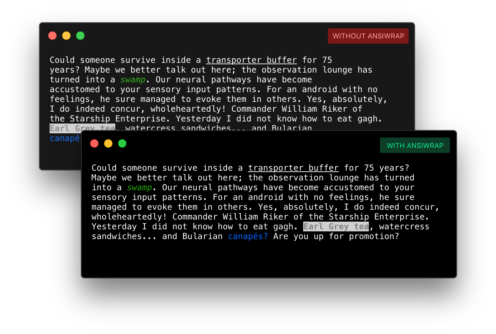
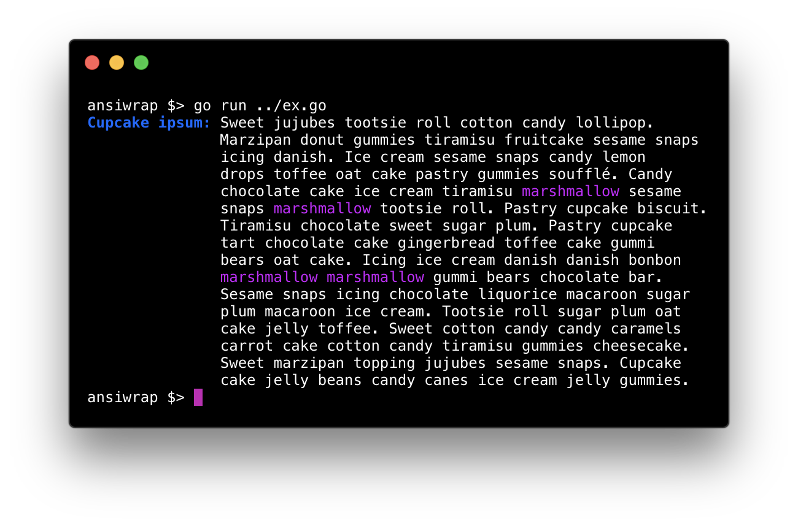

# `ansiwrap`

ANSI escape sequence / unicode aware text wrapping for Go.

[Code of Conduct](./CODE_OF_CONDUCT.md) |
[Contribution Guidelines](./.github/CONTRIBUTING.md)

[](https://github.com/manifoldco/ansiwrap/releases)
[](https://godoc.org/github.com/manifoldco/ansiwrap)
[](https://travis-ci.org/manifoldco/ansiwrap)
[](https://goreportcard.com/report/github.com/manifoldco/ansiwrap)
[](./LICENSE.md)

## Why `ansiwrap`?



> Old text wrappers can't handle ANSI escape sequence formatting,
> but `ansiwrap` knows what to do!

## Features

- ANSI escape sequence aware
- unicode aware
- Greedy and balanced text wrapping
- Flexible indenting

## Example

### Screenshot



### Code

```go
package main

import (
	"fmt"
	"github.com/manifoldco/ansiwrap"
)

// text including ANSI formatting
const text = "Sweet jujubes tootsie roll cotton candy lollipop. Marzipan donut" +
	" gummies tiramisu fruitcake sesame snaps icing danish.  Ice cream sesame snaps" +
	" candy lemon drops toffee oat cake pastry gummies soufflé. Candy chocolate cake" +
	" ice cream tiramisu \033[35mmarshmallow\033[0m sesame snaps" +
	" \033[35mmarshmallow\033[0m tootsie roll. Pastry cupcake biscuit. Tiramisu" +
	" chocolate sweet sugar plum. Pastry cupcake tart chocolate cake gingerbread" +
	" toffee cake gummi bears oat cake. Icing ice cream danish danish bonbon" +
	" \033[35mmarshmallow\033[0m \033[35mmarshmallow\033[0m gummi bears chocolate bar." +
	" Sesame snaps icing chocolate liquorice macaroon sugar plum macaroon ice cream." +
	" Tootsie roll sugar plum oat cake jelly toffee. Sweet cotton candy candy" +
	" caramels carrot cake cotton candy tiramisu gummies cheesecake. Sweet marzipan" +
	" topping jujubes sesame snaps. Cupcake cake jelly beans candy canes ice cream" +
	" jelly gummies."

func main() {
	// Add your favorite ANSI escape code library, and terminal width reporter.

	// A bold and blue label
	label := "\033[1;34mCupcake ipsum:\033[0m "

	// count the printable characters in label
	rc := ansiwrap.RuneCount(label)

	// Wrap the text to 80 chars, aligning with the end of the label
	// Lines are wrapped with minimal raggedness, as the text is long enough
	// to have ansiwrap choose the Balanced algorithm.
	fmt.Println(ansiwrap.WrapIndent(label+text, 70, 0, rc))
}
```

For more examples and documentation, see the
[GoDoc reference](https://godoc.org/github.com/manifoldco/ansiwrap)
